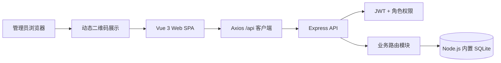
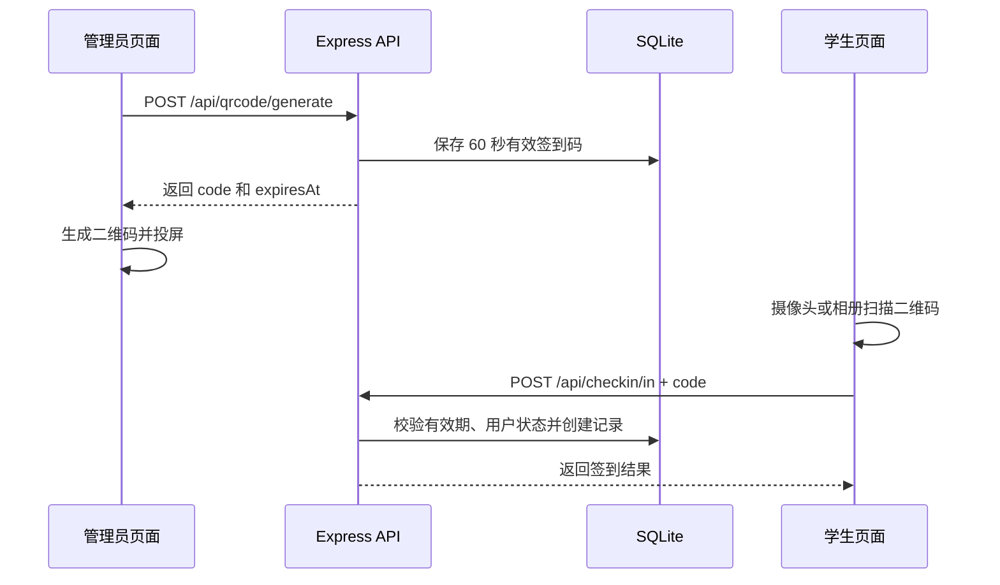

# 当前项目架构

## 1. 总体结构

项目由两个独立的 Node.js 包组成：



- `web/`：Vue 3 + Vite 单页应用，负责页面、路由、交互和图表。
- `server/`：Express 模块化单体 API，负责认证、权限、业务规则和数据库访问。
- `server/data/`：运行时 SQLite 数据库目录，不应提交数据库文件。
- 当前没有根级 `package.json`，前后端需要分别安装、启动和构建。

## 2. 前端架构

```text
web/src/
├── api/request.js       Axios 实例、Token 注入、401 处理
├── stores/user.js       Pinia 登录状态和用户角色
├── router/index.js      路由定义、登录守卫、管理员守卫
├── components/
│   ├── Layout.vue       登录后的侧栏、顶部栏和主内容容器
│   └── BrandLogo.vue    电子实验室品牌 Logo
└── views/
    ├── Login.vue        登录
    ├── ForgotPassword.vue 密码找回
    ├── Checkin.vue      签到、签退、摄像头/相册扫码
    ├── MyRecords.vue    学生个人记录
    └── admin/
        ├── Dashboard.vue    管理统计看板
        ├── QrCodeView.vue   动态二维码生成与展示
        ├── RecordsAdmin.vue 全部记录管理
        └── UsersAdmin.vue   用户和找回码管理
```

### 前端数据流

1. 页面通过 `api/request.js` 调用 `/api`。
2. 请求拦截器从 Pinia 用户状态读取 JWT，并写入 `Authorization: Bearer ...`。
3. 响应遇到 401 时清理登录状态并跳转登录页。
4. 路由守卫负责用户体验层面的访问控制；真正的权限必须由后端再次校验。
5. 签到页使用 `html5-qrcode` 扫描摄像头或图片中的二维码，提取 `code` 后调用签到接口。

## 3. 后端架构

```text
server/src/
├── index.js              Express 入口、CORS、JSON、中间件和路由注册
├── middleware/auth.js    JWT 签发、登录认证、管理员认证
├── db/database.js        SQLite 初始化、表结构、时间工具、默认管理员
└── routes/
    ├── auth.js           登录、当前用户、修改/找回密码
    ├── users.js          管理员用户管理和一次性找回码
    ├── checkin.js        签到、签退、当前状态
    ├── qrcode.js         60 秒动态签到码
    ├── records.js        个人记录和管理员全部记录
    └── stats.js          概览、趋势、时长排行
```

后端采用共享数据库模块直接执行参数化 SQL，没有额外 ORM 或服务层。新增接口时，应优先放入对应业务路由；只有跨模块复用的规则才考虑抽取服务模块。

## 4. 权限边界

- 公开接口：健康检查、登录、使用管理员找回码重置密码。
- 登录接口：当前用户、修改自己的密码、签到签退、个人记录。
- 管理员接口：二维码生成、全部记录、统计、用户管理、生成密码找回码。
- 后端路由通过 `authenticate` 校验 JWT，通过 `requireAdmin` 校验管理员角色。
- 前端 `adminOnly` 仅用于导航体验，不能代替后端授权。

## 5. 核心业务流程

### 动态二维码签到



### 密码找回

管理员在用户管理中生成一次性找回码。服务端只保存找回码的 SHA-256 摘要，找回码 15 分钟有效且使用后失效；用户通过用户名、找回码和新密码完成重置。

## 6. 数据模型

- `users`：账号、密码哈希、姓名和角色。
- `checkin_codes`：动态签到码、创建时间和过期时间。
- `checkin_records`：签到时间、签退时间、持续时长和状态。
- `password_reset_tokens`：用户、找回码摘要、过期时间和使用时间。

密码使用 `bcryptjs` 哈希；JWT 默认有效期为 24 小时。服务端时间是签到和过期判断的依据，客户端时间只用于显示倒计时。

## 7. 运行与验证

```bash
# 后端
cd server
npm install
npm run dev

# 前端
cd web
npm install
npm run dev
npm run build
```

后端目前没有稳定的独立测试脚本约定时，至少对改动的 `.js` 文件运行 `node --check`；修改前端时运行 `npm run build`。完整命令和部署说明见 [README.md](README.md)。

## 8. App 演进建议

当前 Web SPA 可以通过 Capacitor 打包为 Android/iOS：

- 复用 `web/src` 的页面、路由、状态和 API 层。
- 将 `html5-qrcode` 替换为 Capacitor 原生条码扫描插件，改善摄像头权限和扫码体验。
- 学生端可打包为 App，管理员端继续保留 Web 管理后台。
- 小规模部署可继续使用 SQLite；多人并发或服务器集群部署时迁移 PostgreSQL。
- 签到仍必须在线由服务端校验，不能把动态码验证完全放到 App 本地。
